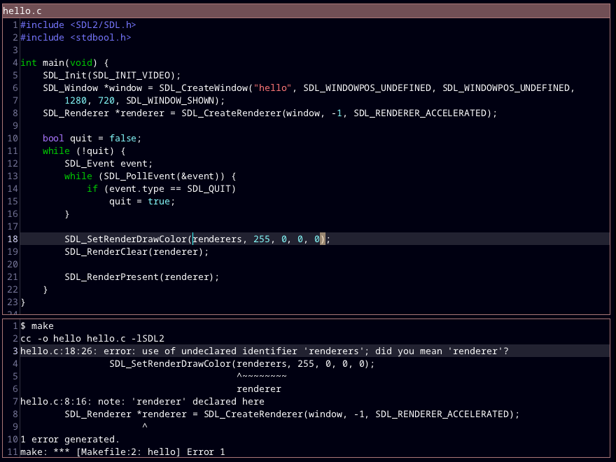

# ted

A text editor.



To download installers for ted for Windows and Debian/Ubuntu, go to
the [releases](https://github.com/pommicket/ted/releases).

On Debian/Ubuntu if you want automatic updates, you can also
[add my repository to apt](https://s.pommicket.com/deb/), and just do

```sh
sudo apt install ted
```

<!-- WEBSITE INDEX.HTML ON -->

## Why?

There are a lot of text editors out there. ted doesn't do anything new.
Here are some benefits of ted:

- Starts up immediately.
- Doesn't lag for reasonably-sized files.
- VERY small - a full ted installation is &lt; 5 MB.

ted isn't incredibly complicated, but it does have some nice features you might not find
in other editors.

## Supported features

- Customization of (pretty much) all colors and keyboard commands.
- Basic text editing like copy+paste, undo+redo, etc.
- Multiple tabs, each with a different file
- Split screen
- Auto-indent
- Syntax highlighting for C, C++, C#, CSS, GdScript, GLSL, Go, HTML, Java, JavaScript, LaTeX, Markdown, Python, Rust, and TypeScript.
- Find and replace (with regular expressions!)
- Run build command, go to errors
- Run any shell command
- Autocomplete
- Go to definition
- Go to line number
- Indent/dedent selection, comment/uncomment selection
- Keyboard macros

<!-- WEBSITE INDEX.HTML OFF -->

## Guide

For how to use ted, see [GUIDE.md](GUIDE.md).

<!-- WEBSITE INDEX.HTML ON -->

## Building from source

Download `ted`'s source tree with the link above or

```
git clone --recursive https://cgit.pommicket.com/ted.git
```

If you didn't use the command above,
run `git submodule update --init --recursive` to download ted’s dependencies.

To install `ted` from source on Linux, you will also need:

- A C compiler
- The SDL3 development libraries
- cmake
- imagemagick convert (for creating the .deb installer)

These can be installed on Ubuntu/Debian with:

```bash
sudo apt install clang libsdl3-dev cmake imagemagick
```

Then run `make -j ted.release` to build then `sudo make install` to install.
You can also run `make -j ted.deb` to build the .deb installer.
If your operating system is old enough that it doesn’t have an SDL3 package,
you can also build a version with SDL3 statically linked in, using
`make -j ted-static-sdl.release`, then install with `sudo make install-ted-static-sdl`.

This installs ted for all users. If you just want to install it for yourself (or you don't have superuser access), you can do so
with

```bash
mkdir -p ~/.local/bin ~/.local/share
GLOBAL_DATA_DIR='~/.local/share/ted-data' LOCAL_DATA_DIR='~/.local/share/ted' INSTALL_BIN_DIR='~/.local/bin' make install -j
```

On Windows, install Microsoft Visual Studio 2026, then find and add vcvarsall.bat to your PATH
(most likely lives at `C:\Program Files\Microsoft Visual Studio\2026\Community\VC\Auxiliary\Build`).
Also, install the [Visual Studio Installer Projects extension](https://marketplace.visualstudio.com/items?itemName=VisualStudioClient.MicrosoftVisualStudio2022InstallerProjects)
(needed to build the .msi installer).

Next you will need the SDL3 VC development libraries: https://github.com/libsdl-org/SDL/releases (named `SDL3-devel-3.x.y-VC.zip`;
you might have to click "show all assets").
Extract the zip, copy SDL3-3.x.y into the ted directory, and rename it to SDL3. Also copy SDL3\\lib\\x64\\SDL3.dll
to the ted directory.
Then run `make.bat release`.

## License

ted is in the public domain (see `LICENSE.txt`).

## Reporting bugs

You can report a bug by sending an email to `pommicket at pommicket.com`
or by creating an [issue on GitHub](https://github.com/pommicket/ted/issues).

If ted is crashing on startup try doing these things as temporary fixes:

- Delete `~/.local/share/ted/session.txt` or `C:\Users\<your user name>\AppData\Local\ted\session.txt`
- Reset your ted configuration by moving `ted.cfg` somewhere else.

