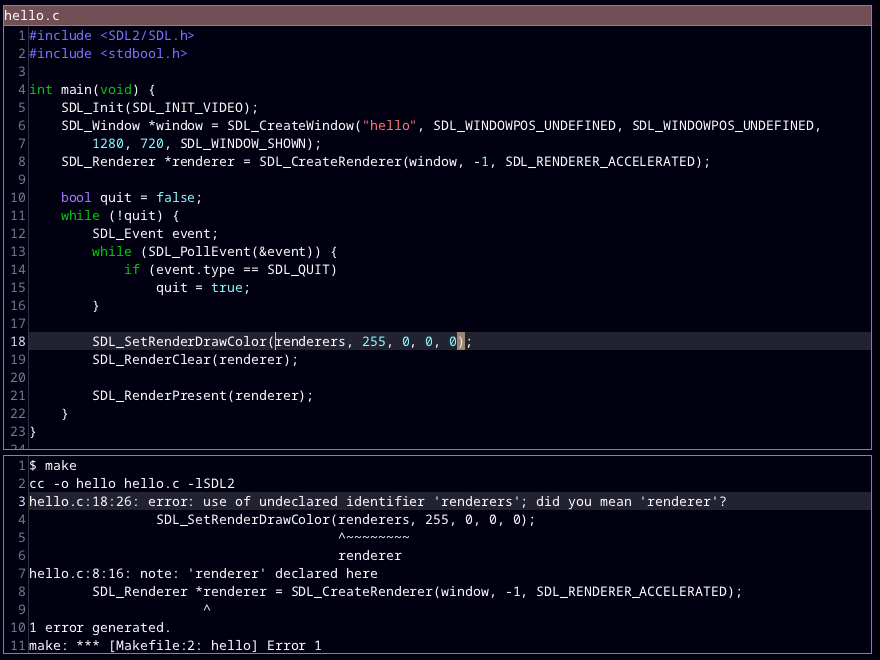

# ted

A text editor.

**ted is still very new, and there are almost certainly bugs. There are also definitely important features missing. I don't recommend using this as your main text editor yet.**



To install `ted` on Linux, you will need:

- A C compiler
- SDL2
- The GL development libraries

These can be installed on Ubuntu/Debian with:

```
sudo apt install gcc libsdl2-dev libgl-dev
```

Then run

```
sudo make install -j4
```

There is no nice way of installing on Windows yet.

## Why?

There are a lot of text editors out there. ted doesn't do anything new.
But in the modern world of text editors running browsers internally, it can be nice to have
a simple editor that starts up practically instantaneously, and performs well on reasonably-sized files.

## Supported features (more coming soon)

- Multiple tabs, each with a different file
- Auto-indent
- Customization of (pretty much) all colours and keyboard commands.

## Building from source

On Linux, run `make`.

On Windows, you will need the SDL2 VC development libraries: https://www.libsdl.org/download-2.0.php  
Copy SDL2-2.x.y into the ted directory, and rename it to SDL2. Additionally, copy SDL2\lib\x64\SDL2.dll
to the ted directory.  
Then run `make.bat`.

## License

ted is in the public domain (see `LICENSE.txt`).

## Reporting bugs

You can report a bug by sending an email to `pommicket at pommicket.com`.

